# Instrument the browser monitoring

## Introduction

In the previous lab, you instrumented the application with an APM java agent, which captures traces and spans generated by the server. In this lab, you will configure an APM browser agent that captures traces and spans generated by the browser. You will insert a javascript to the application's index.html file to deploy the APM browser agent.

To simplify the application setup process in this workshop, the webpage to instrument (index.html) is located in a Kubernetes pod. You will copy the file from the container, edit the file by injecting the JavaScript, then copy it back into the container.  


Please note that these changes will be lost when the pods are recreated. This setup is only to keep the lab steps simple. In the real use cases, you will need the changes preconfigured in the image, or deploy the static content to the shared location so that the changes will be kept when Kubernetes pods are recreated.

In this lab, you will learn how to use the APM Trace Explorer to trace the workload generated with the WineCellar demo application.

Estimated time: 5 minutes

### Objectives

* Instrument browser by injecting JavaScript code to the webpage
* Open APM Trace Explorer from the Oracle Cloud console
* Verify traces and spans generated by the APM agents configured in Lab 5 and 6
* Examine values in the span dimensions for the frontend browser and the backend Spring Boot server
* Use dimensions to automatically update the query and filter the selection

### Prerequisites

* Completion of the preceding labs in this workshop

## Task 1: Copy a webpage from the container


1. Run the oci ce (Container Engine) command that was saved in Lab 6, Task 2, step 4.

2. Execute the following command to copy ***index.html*** from the container to the home directory.

    ``` bash
    <copy>
    cd ~/;kubectl cp wstore-front-0:static/index.html ./index.html
    </copy>
    ```

3.	Run the "ls -l" command in the home directory, to verify that the file is transferred to the Cloud Shell.

    ``` bash
    <copy>
    ls
    </copy>
    ```

   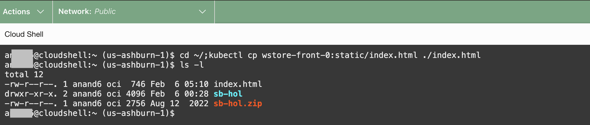

## Task 2: Update the webpage with APM browser agent injection
1.	Open the index.html with an editor.

    ```bash
    <copy>
    vi ~/index.html
    </copy>
    ```

2. Insert the following JavaScript to the index.html file, just below the &lt;/head&gt; tag. Replace **Data Upload Endpoint** and the **Public Data key**. Note that there are two locations you will need to replace the Data Upload Endpoint.


    ```bash
    <copy>
    <script>
    window.apmrum = (window.apmrum || {});
    window.apmrum.serviceName='wstore-web';
    window.apmrum.webApplication='WStore App';
    window.apmrum.ociDataUploadEndpoint='<DataUploadEndpoint>';
    window.apmrum.OracleAPMPublicDataKey='<Public_Datakey>';
    window.apmrum.traceSupportingEndpoints =  [ { headers: [ 'APM' ], hostPattern: '.*' } ];
    </script>
    <script async crossorigin="anonymous" src="<DataUploadEndpoint>/static/jslib/apmrum.min.js"></script>
    </copy>
    ```
    Save the changes and close the file.

    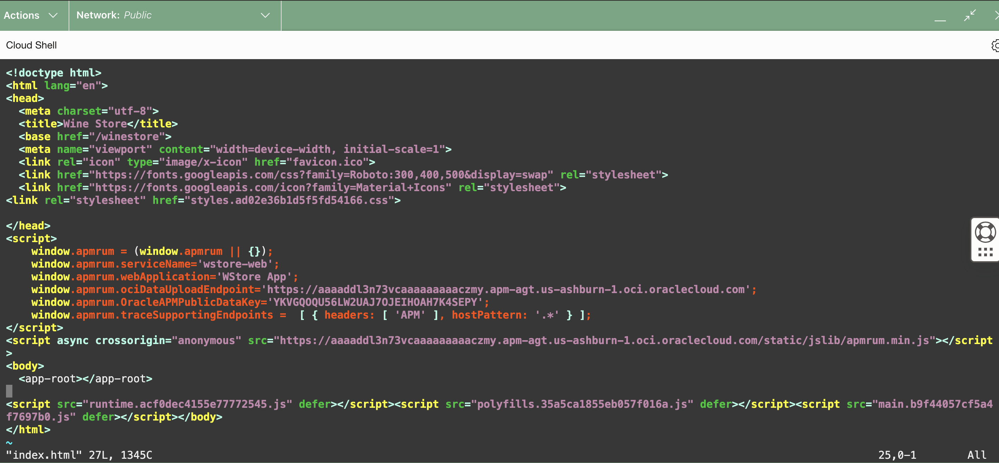

## Task 3: Copy the webpage back to the container

1. Execute the following command to copy the ***index.html*** file back to the container.

     ``` bash
     <copy>
     cd ~/;kubectl cp ./index.html wstore-front-0:static/index.html
     </copy>
     ```
  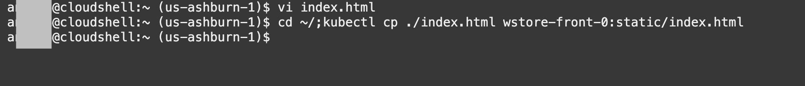

2. Verify the successful file transfer, by running the following command.


    ``` bash
    <copy>
    kubectl exec -it wstore-front-0 -- bash -c "cd static && cat index.html "
    </copy>
    ```
    Ensure you see the changes made in the previous step.

    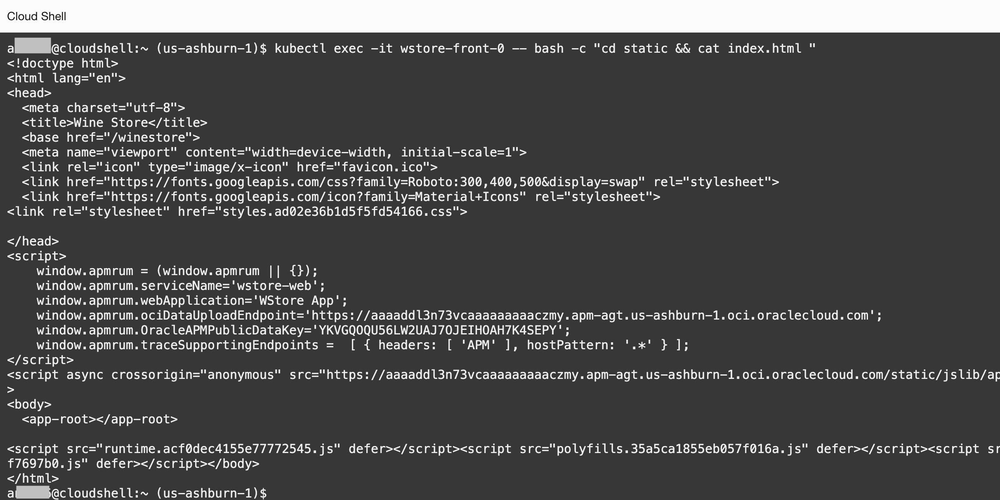

    In the next lab, you will see application traces starting from the browser.   


## Task 1: Verify the Browser Agent instrumentation in the WineCellar app


1. If you are starting a new Oracle Cloud Shell session, run the oci ce (Container Engine) command that you saved in Lab 3, Task 2, step 5.

2. From the Oracle Cloud shell, enter the following command.

    ``` bash
    <copy>
    kubectl get svc
    </copy>
    ```

    From the output, find the wstore-frontend service. Note down the External-IP.

   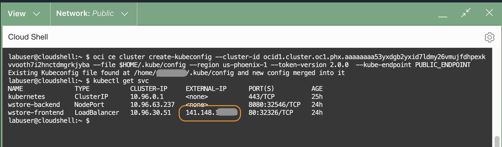


   >**Note:**

   - The IP may be different from the last time when you accessed the WinCellar app because the pods are regenerated.
   - If the application is not starting up, run the **kubectl get pods** command and check the status. It may take a few minutes to see the pods in the running state.

3.	On your laptop, start a browser and access the application with the URL pattern:

    ``` bash
    <copy>
    http://<External IP of the Load Balancer>/winestore/
    </copy>
    ```
4.  WinCellar application launches.

   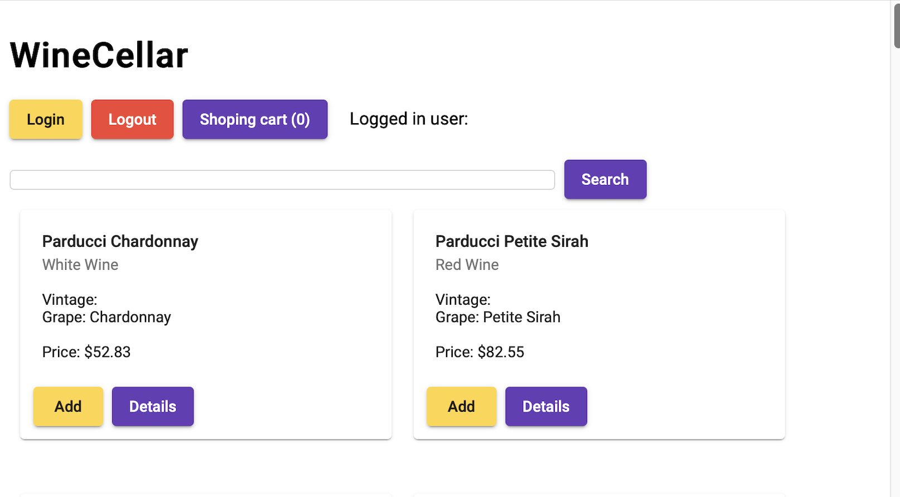

5.  Right mouse click on the browser and select a menu item to view the page source.

   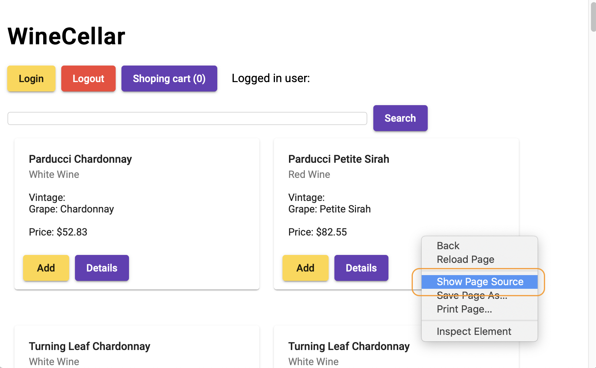

6.  Verify the Browser Agent JavaScript is in the page source.

   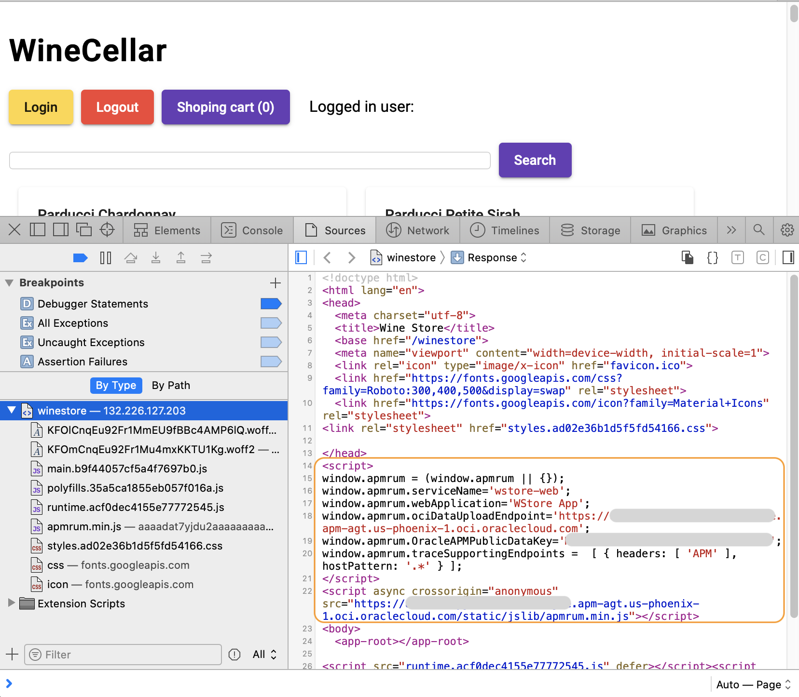


    >**Note:** If you do not see the Browser Agent JavaScript in the source, remove the browser cache, or try with a different browser.

7.  Close the page source.  

   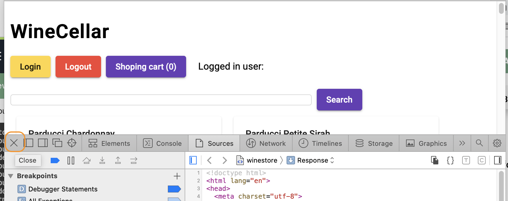


## Task 2: Generate workload by navigating to the app


1.  Click **Login**.

    


2.  Enter your name (or john) as username, leave the password blank, and click **Login**.

    


3. Then click around the buttons in the pages, as in the example flow shown below.

    >**Note:** Do not worry if you see the "Failed" messages, or if it takes a long time for the pages to respond. Those are expected because the app is designed to fail every once and often for demo purposes.

    Click **Add** on a couple of products then hit **Shopping Cart**. Then Click **Checkout**.
    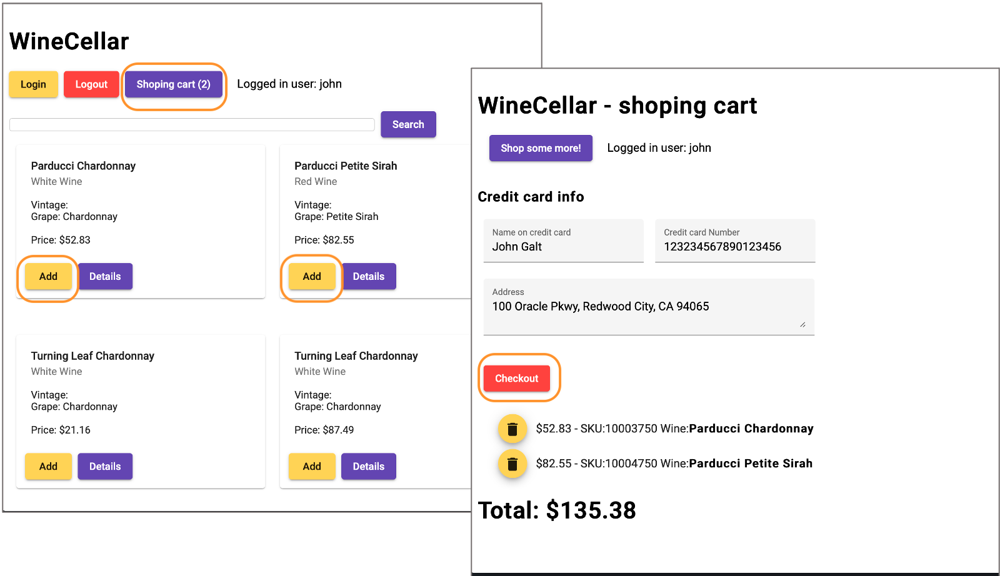
    Click **Confirm Order**, then **Logout**.
    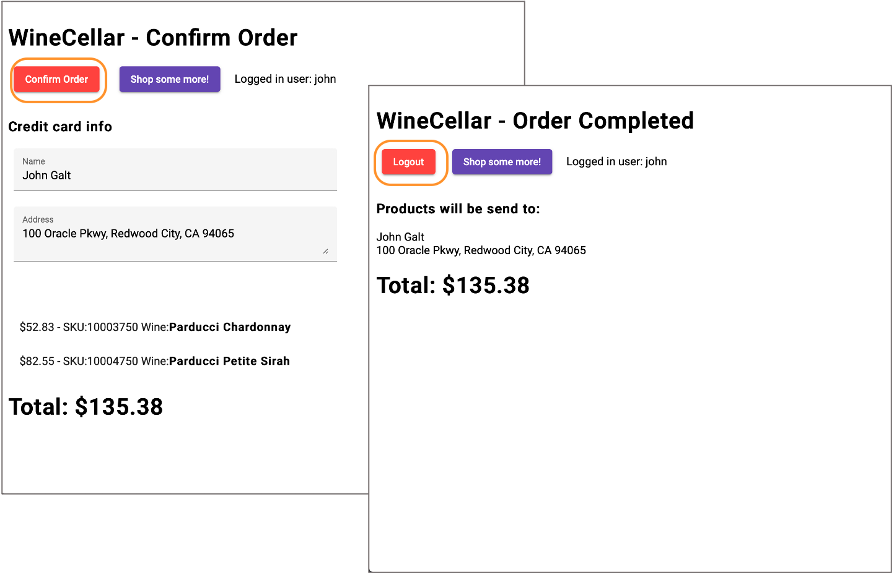


## Task 3: Examine traces in APM Trace Explorer

1. From the OCI menu, select **Observability & Management** > **Trace Explorer**

   

2. On the Trace Explorer page, select **apmworkshop** for the **Compartment** and the **APM Domain**.

   

3.	By default, traces are displayed in the order by the start time. Right mouse click on the **Duration** column, select **Sort Descending** to show the traces by duration in descending order. This will bring the slowest trace to the top of the list.

   

4. Hover the mouse over the bar in the **Spans** column at the top row. Verify three services are included in the trace, and each color represents a service, wstore-back, wstore-front, and wstore-web, which you defined in the previous labs.

  

5.	Click the trace link at the **Service:Operationame** column.

   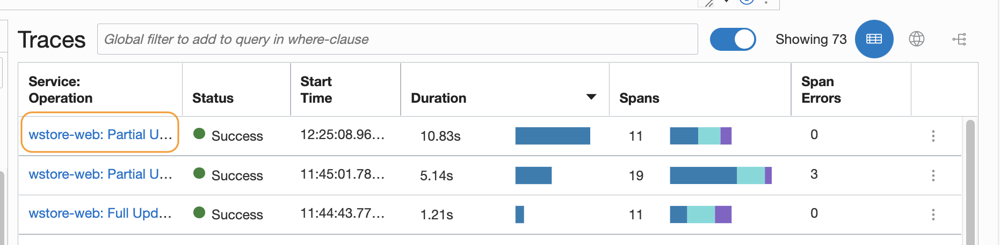

   >**Note:** If you do not see a slow trace with a duration of 10 seconds or more, you can navigate the WineStore demo app a few times until you see the programmed slowness in the checkout service.

6. **Trace Details** page opens. Review the trace information on the upper screen. E.g., Status, Trace ID, Whether it has an error or not, how many spans and services are involved, or the duration of the trace.
   

7. In the **Topology** view, you can see how the operations are connected within the trace. Different colors indicate different services. Hover the mouse on the icons and the arrows that connect the icons. Review the information in the callouts.
  

  In this example, it seems that the checkout service is where the most time was spent in the trace.

  >**Note:** The operations may look differently in the trace you selected.

8. Scroll down the page to show the **Spans** view. Spans in the trace are displayed in a Gantt chart. A span at the top of the list is the root span, and the child spans are nested below the root span.

  

  In this example, one of the operations is taking 9 seconds alone, out of the total duration of 10 seconds. This seems to be the bottleneck of the slowness.

9. Click the operation name link.

  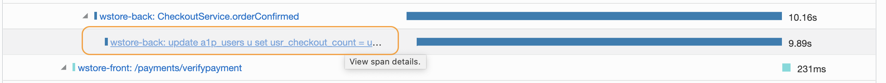

10. This opens a **Span Details** view. Review the span information, such as the operation name, which service it belongs to, start date and time, start time after the trace started, duration of the span, Trace ID, and Span ID.

  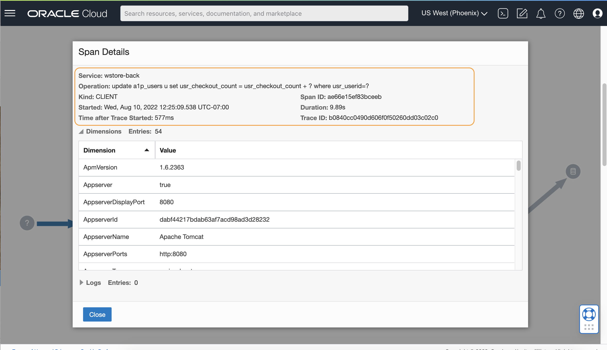

  From the operation name, this is a JDBC span that is generated by requesting a call to the database.

11. Scroll down and review the collected dimension values. In this example, there are 54 dimensions collected. E.g., App server, Host, Kubernetes, and performance information. In addition, it has database information, because this is a JDBC span.

  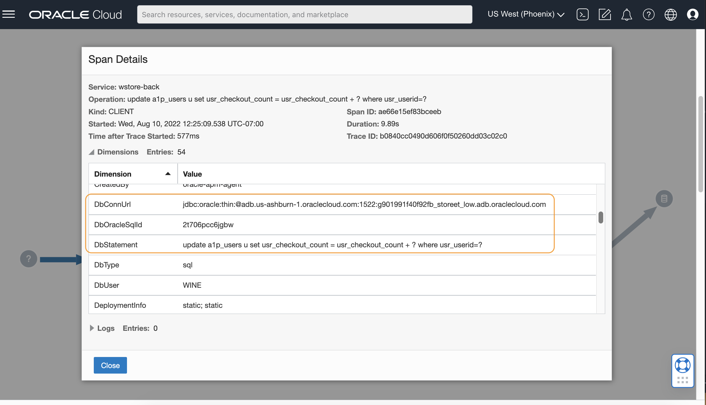

12. Click **Close** at the lower left corner of the window to close the **Span Details** view.

13. Click the **Trace Explorer** link from the breadcrumbs. This will bring you back to the Trace Explore the main view.

  

## Task 4: Filter traces with dimensions

1. Type '**apdex**' into the search field in the **Fields** section. Then click **ApdexLevel** from the list.

  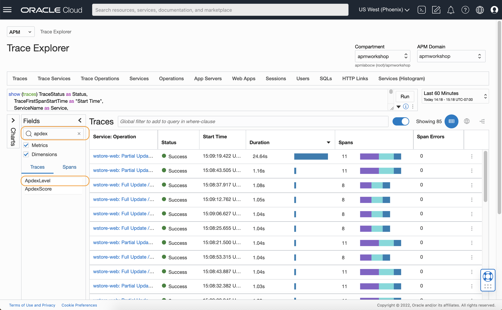

2. **Dimension ApdexLevel Values** window opens. Apdex or Application Performance Index measures customer satisfaction based on applications' page or service performance. Review the values and counts. In this example, there are 10 frustrated traces, 69 satisfied traces, and 4 tolerating traces.

  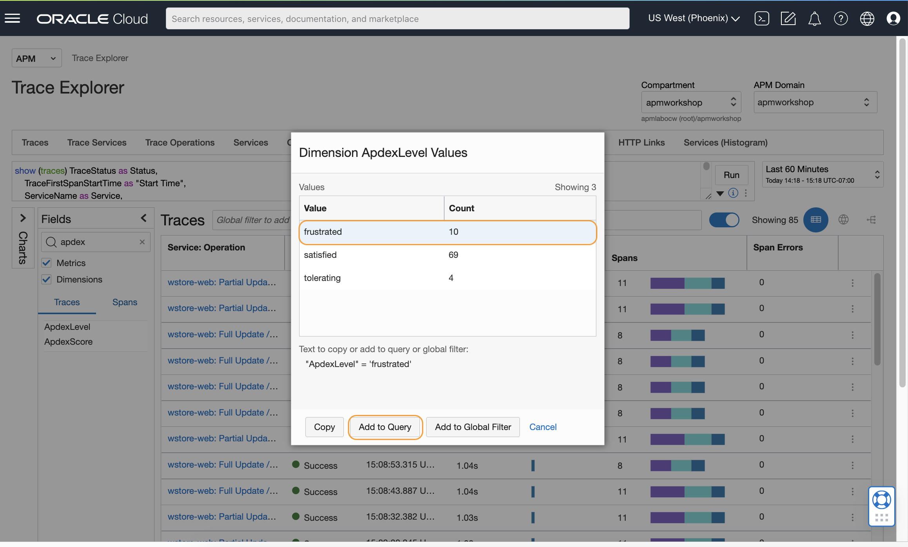

  Select **frustrated** from the list, then click **Add to Query**.

3. Notice that the condition  **("ApdexLevel" = 'frustrated')** has been inserted to the query. Hit **Run**.

  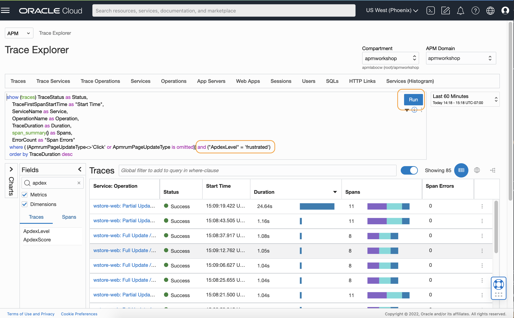

4. Traces view is refreshed and shows only traces **ApdexLevel** is frustrated.

  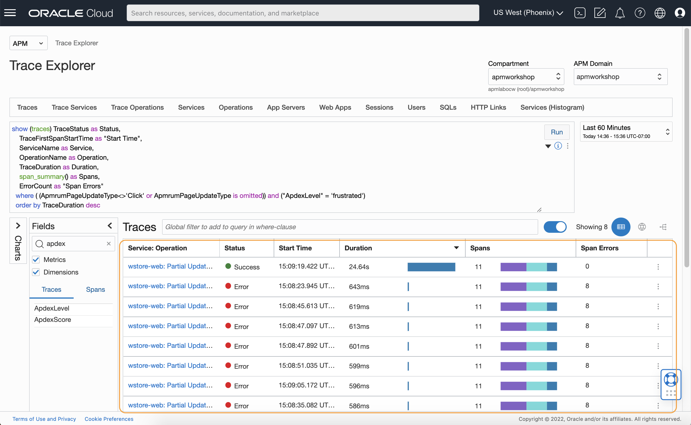


## Conclusions

In this workshop, you’ve learned how to use a file system by adding the APM Java agent to the microservices web application. You have also learned how to configure the APM Browser agent, and how to use APM Trace Explorer to view traces and spans. For more information on APM, refer to the OCI documentation, **[Application Performance Monitoring](https://docs.oracle.com/en-us/iaas/application-performance-monitoring/index.html)**.

## Acknowledgements

* **Author** - Anand Prabhu, Principal Member of Technical Staff, Enterprise and Cloud Manageability
- **Contributors** -
Yutaka Takatsu, Senior Principal Product Manager,  
Avi Huber, Vice President, Product Management
* **Last Updated By/Date** - Anand Prabhu, January 2024